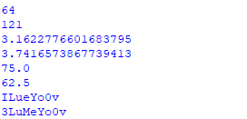

 ## PROSES / LANGKAH - LANGKAH PRAKTIKUM 7

- Ubahlah kode di bawah ini  menjadi menggunakan fungsi lambda 

## TUGAS PRAKTIKUM 

- Buat program sederhana dengan menggunakan fungsi yang akan menampilkan daftar nilai mahasiswa, Dengan ketentuan:

- Fungsi - Tambah() untuk menambah data 
- Fungsi - Tampilkan() untuk menampilkn data
- Fungsi - Hapus(nama) untuk menghapus data berdasarkan nama
- Fungsi - Ubah (nama) untuk mengubah data berdasarkan nama
- Buat penjelasan README.md

# Daftar nilai menggunakan fungsi

- Awal awal sebelum kita masuk ke fungsi kita membuat dictionary dulu 

# Setelah dictionary, kita akan menampilan data dengan menggunakan fungsi

- Fungsi untuk menambahkan data 

- Fungsi untuk menampilan data 

- Fungsi untuk menghapus data berdasarkan nama

- Fungsi untuk mengubah data berdasarkan nama

